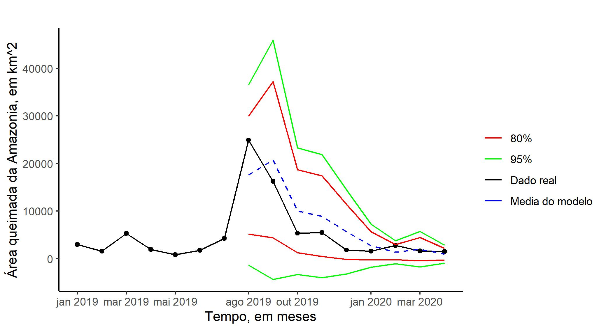

# queimadas

<!-- badges: start -->
<!-- badges: end -->

O objetivo do repositorio "queimadas" foi conduzir uma análise sobre os dados das queimadas na amazônia de 2019. Para isso, foi conduzido um modelo ETS de séries temporais para averiguar se a quantidade de queimadas na época de agosto de 2019 foi acima do esperado, baseado nos anos passados, ou não.

